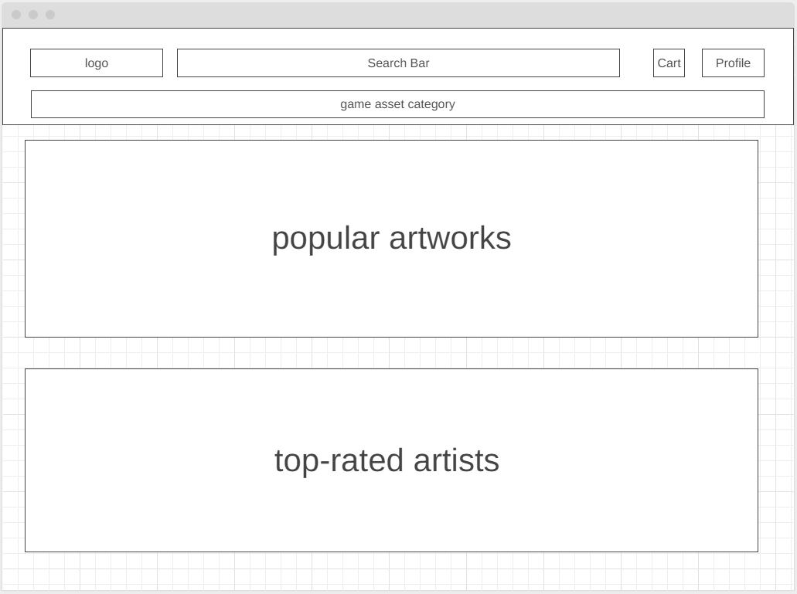
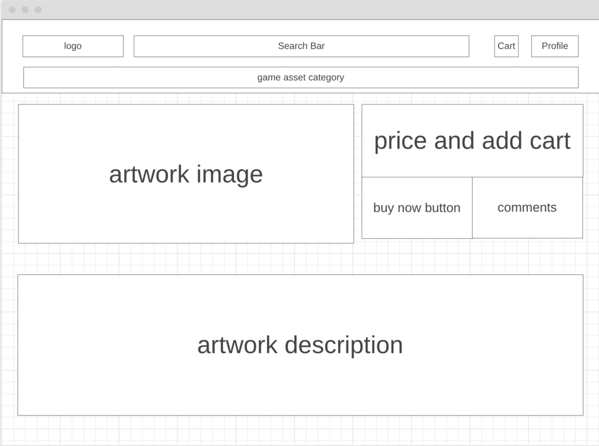
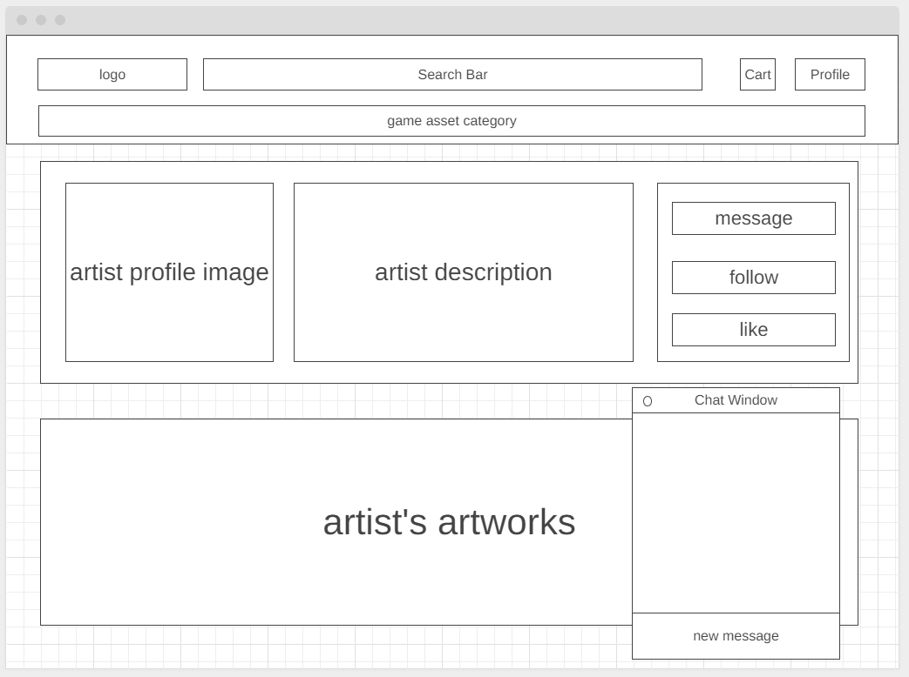

# PandaPixel
#### PixelPanda is a game assets website that allows game artists to upload, edit, and delete their artworks online to sell. Buyers or game developers can browse the website to search for assets such as images, models, and music they need. They can also directly contact the artists to negotiate the price with the artists or send an artwork request with an offer and a deadline. 

## Functionalities & MVPs
* Shopping cart
* Artworks(CRUD)
* Artworks comments(CRUD)
* Search functionality

## Bonus Features
* Real-time communication between the artist and buyers 
* End-to-end encryption
* Live drawing for sketch of custom artwork
* Search functionality
* Level tiers for buyers and sellers to trust each other more

## Technologies
* Frontend: React and React Native with Redux
* Backend: Node, Express, MongoDB
* AWS
* Websocket

## UI/UX

### Wireframes
#### Splash Page

#### Artwork Show Page

#### Artist Show Page

## Team members and roles
Dilang Lin: Project Lead

Kenny Tram: Project Frontend Lead

James Wu: Project Backend Lead